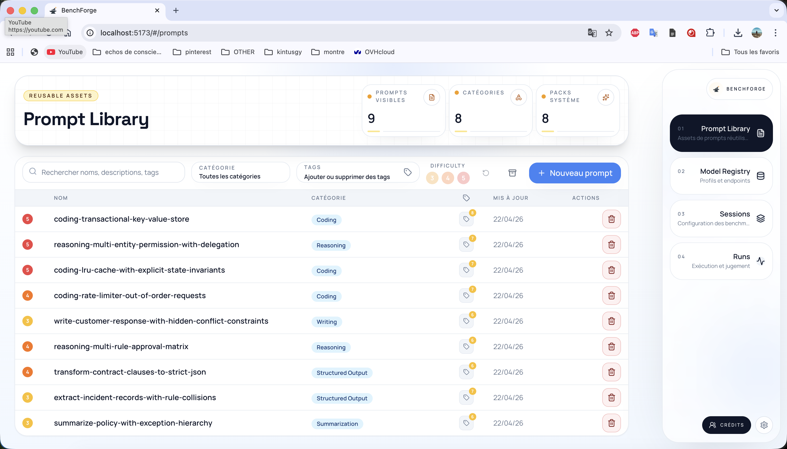
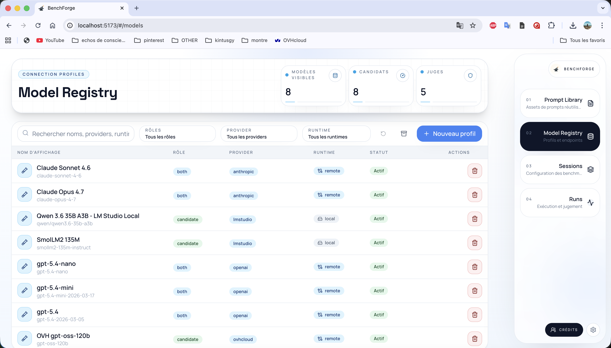
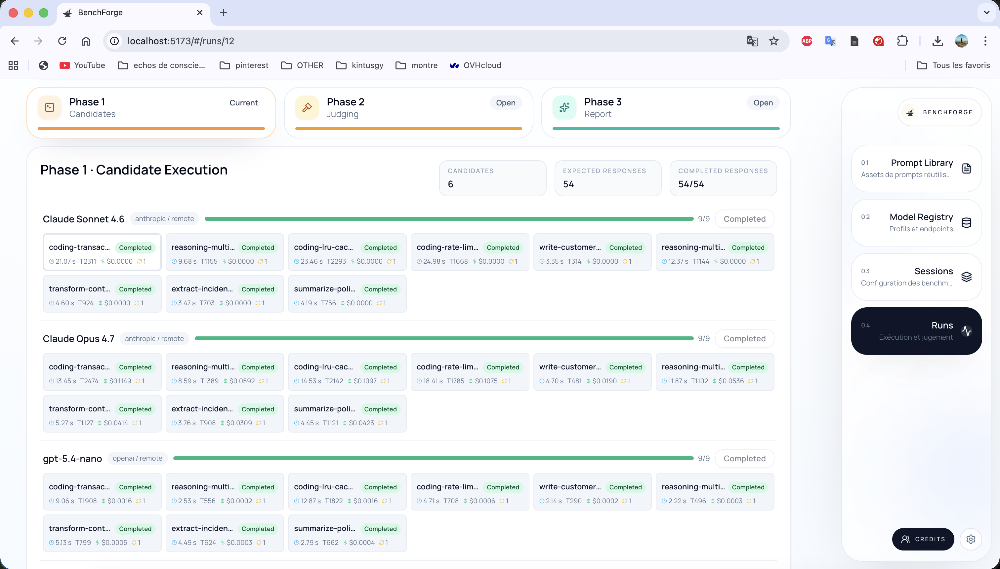
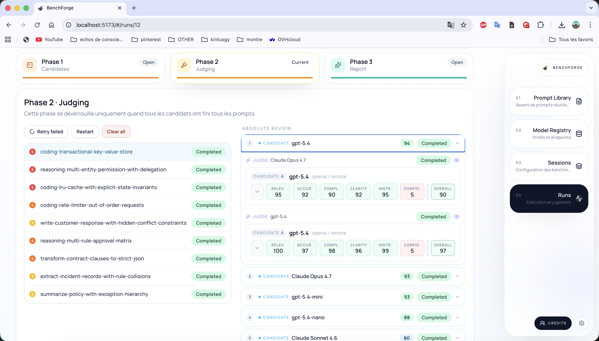
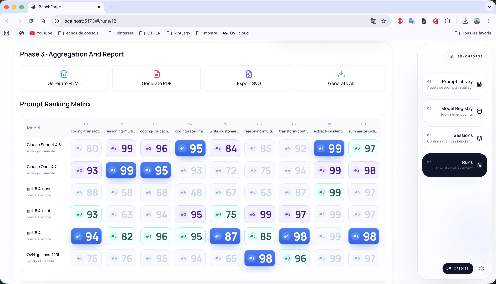
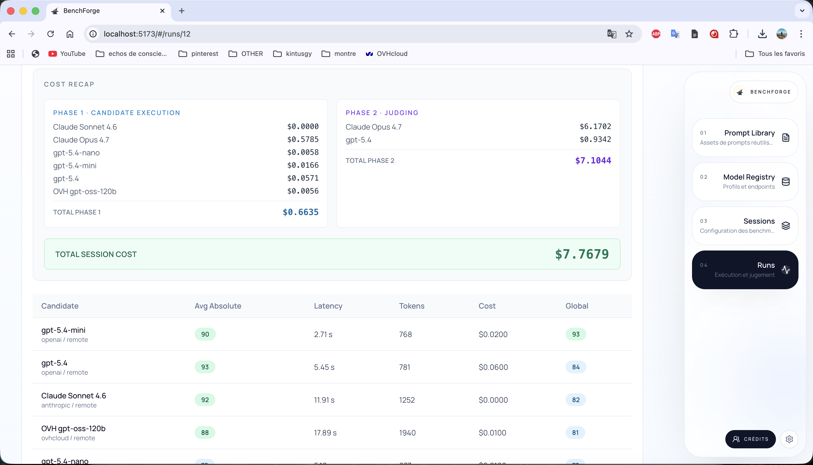

# BenchForge

BenchForge is an open-source, self-hostable benchmark studio for evaluating local
and remote language models with reusable prompts, structured LLM-as-a-judge
scoring, and polished reports.

This repository includes the core application flow for building benchmark sessions,
running evaluations, scoring outputs with a judge model, and generating reports.

<table>
  <tr>
    <td></td>
    <td></td>
  </tr>
  <tr>
    <td></td>
    <td></td>
  </tr>
  <tr>
    <td></td>
    <td></td>
  </tr>
</table>

## Current scope

- Prompt library with built-in seeded benchmark prompts
- Model registry for local and remote providers
- Session builder with candidates and judge selection
- Run execution flow for remote and guided local models
- Two-phase LLM-as-a-judge scoring:
  - **Absolute phase** — each candidate is scored individually (0–100) across relevance, accuracy, completeness, clarity, and instruction-following, with strengths/weaknesses and a confidence score (1–5)
  - **Arena phase** — top-scoring candidates are paired for head-to-head comparisons; pairs are selected from the top 3 absolute scores, with an extra pair when the gap between 1st and 3rd is ≤ 3 points
- Aggregation and global summaries across all judge batches
- HTML and PDF report generation

## Stack

- Backend: FastAPI, Python 3.12+, `uv`
- Frontend: React, TypeScript, Vite, Tailwind CSS, ShadCN-ready structure
- Database: PostgreSQL
- Tooling: Ruff, mypy, pytest, ESLint, Prettier

## Repository layout

```text
backend/
frontend/
docs/
docker/
scripts/
```

## Quick start

### First time

1. Create the local environment file:

   ```bash
   cp .env.example .env
   ```

   The default local setup expects PostgreSQL on `localhost:5432`, the backend on
   `localhost:8000`, and the frontend on `localhost:5173`.

2. Start PostgreSQL:

   ```bash
   docker compose up -d postgres
   ```

3. Install backend dependencies:

   ```bash
   cd backend
   uv sync
   ```

4. Apply database migrations:

   ```bash
   cd backend
   uv run alembic upgrade head
   ```

5. Install frontend dependencies:

   ```bash
   cd frontend
   npm install
   ```

6. Start the backend dev server:

   ```bash
   ./scripts/dev-backend.sh
   ```

7. Start the frontend dev server in another terminal:

   ```bash
   ./scripts/dev-frontend.sh
   ```

8. Open the app:

   - Frontend: `http://localhost:5173`
   - Backend health: `http://localhost:8000/api/health`

Built-in benchmark prompts are seeded automatically the first time the prompt library
or prompt categories API is loaded against a migrated database.

### Next runs

For the usual local workflow after the first setup:

1. Start PostgreSQL:

   ```bash
   docker compose up -d postgres
   ```

2. If the schema changed, apply migrations:

   ```bash
   cd backend
   uv run alembic upgrade head
   ```

3. Start backend and frontend in separate terminals:

   ```bash
   ./scripts/dev-backend.sh
   ./scripts/dev-frontend.sh
   ```

### First functional test

Once the app is running, the shortest useful test flow is:

1. Open `Prompt Library` and confirm the built-in prompts are present.
2. Add at least one candidate model and one judge model in `Model Registry`.
3. Create a session in `Sessions`.
4. Launch a run.
5. Follow execution, judging, aggregation, and report generation in `Runs`.

## Available commands

### Backend

- `uv run ruff check .`
- `uv run ruff format --check .`
- `uv run mypy app`
- `uv run pytest`

### Frontend

- `npm run dev`
- `npm run build`
- `npm run lint`
- `npm run format:check`

## Documentation

Product and delivery documentation lives in [docs/README.md](/Users/alexis/Documents/GitHub/BenchForge/docs/README.md:1).
